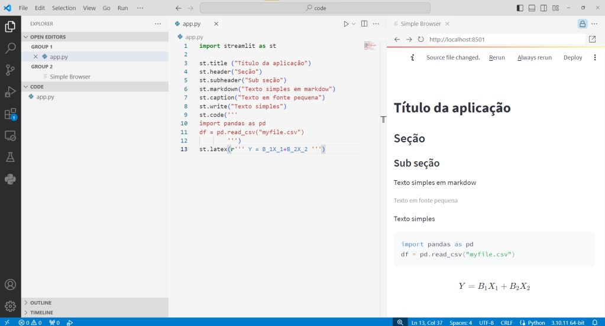
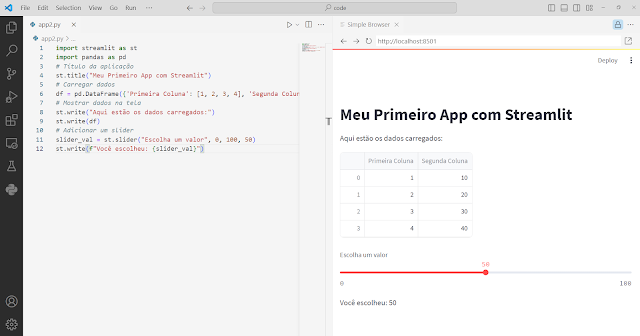

<!--@include: cabecalho.md-->

O [Streamlit](https://streamlit.io/) é uma biblioteca de código aberto em Python que facilita a criação de aplicativos web interativos e de visualização de dados de forma rápida e simples. É amplamente utilizada por cientistas de dados, analistas e desenvolvedores que desejam transformar seus scripts de Python em aplicações web interativas sem a necessidade de conhecimentos avançados em desenvolvimento web.

As principais características do Streamlit são:

* Facilidade de Uso: Permite criar interfaces de usuário com poucas linhas de código, utilizando uma sintaxe intuitiva e fácil de aprender.

* Interatividade: Possibilita adicionar widgets interativos como sliders, botões, e caixas de seleção para que os usuários possam interagir com os dados e visualizar os resultados em tempo real.

* Integração com Bibliotecas de Dados: Funciona bem com outras bibliotecas populares de Python como `pandas`, `numpy`, `matplotlib`, `seaborn`, entre outras, facilitando a visualização e manipulação de dados.

* Atualização em Tempo Real: As mudanças nos scripts de Python são automaticamente refletidas na aplicação web, permitindo um desenvolvimento iterativo e rápido.

* Desempenho: Otimizado para lidar com grandes volumes de dados e processamento intensivo, mantendo um desempenho adequado para aplicações complexas.

## Exemplos de uso

Um simples exemplo com StreamLit:

```python
import streamlit as st
import pandas as pd
# Título da aplicação
st.title("Meu Primeiro App com Streamlit")
# Carregar dados
df = pd.DataFrame({'Primeira Coluna': [1, 2, 3, 4], 'Segunda Coluna': [10, 20, 30, 40]})
# Mostrar dados na tela
st.write("Aqui estão os dados carregados:")
st.write(df)
# Adicionar um slider
slider_val = st.slider("Escolha um valor", 0, 100, 50)
st.write(f"Você escolheu: {slider_val}")
```

Para rodar a aplicação, você pode salvar o código em um arquivo Python (por exemplo, `app.py`) e executar o comando `streamlit run app.py` no terminal. Isso abrirá uma nova janela do navegador com 
sua aplicação interativa.

```sh
# executar no terminal
$ streamlit run app.py
```

>**Figura 1** - Exemplo StreamLit 1

>Fonte: Giseldo Neo (2024)

Mais um exemplo:

```python
import streamlit as st

st.title ("Título da aplicação")
st.header("Seção")
st.subheader("Sub seção")
st.markdown("Texto simples em markdow")
st.caption("Texto em fonte pequena")
st.write("Texto simples")
st.code(''' 
import pandas as pd
df = pd.read_csv("myfile.csv")
''')
st.latex(r''' Y = B_1X_1+B_2X_2 ''')
```

>**Figura 2** - Exemplo StreamLit 2

>Fonte: O Autor (2024)

## Conclusão

Em resumo, o Streamlit é uma ferramenta poderosa para criar dashboards e visualizações de dados, permitindo compartilhar análises de forma interativa e acessível. Se você está procurando uma maneira rápida e eficiente de transformar suas análises de dados em aplicativos web, o Streamlit é uma excelente escolha.

<!--@include: rodape.md-->