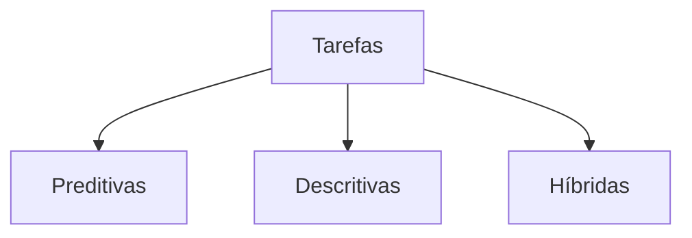
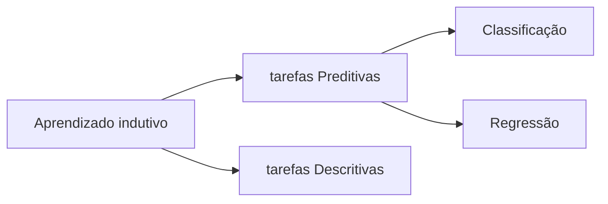
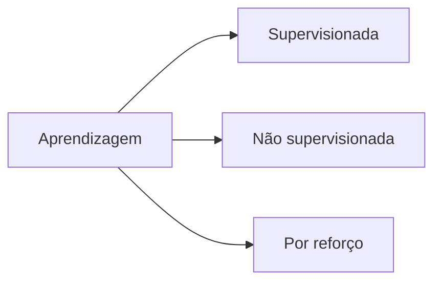

A aprendizagem de máquina (AM) é uma subárea da inteligência artificial. Com AM sistemas de computadores aprendem a partir de dados e realizam previsões sem a necessidade de programação explícita.

Em vez de seguir instruções rígidas, estes algoritmos analisam grandes volumes de dados, identificam padrões e ajustam seus comportamentos com base nas informações adquiridas. 

## Intuição

Considere o problema de diferenciar imagens de cães e gatos. Em vez de programar manualmente características como o formato das orelhas ou o padrão dos pelos, utiliza-se um grande conjunto de imagens rotuladas para treinar o sistema. O algoritmo, de forma autônoma, aprende quais propriedades são mais relevantes para distinguir entre as duas categorias. 

Por exemplo, o algoritmo pode identificar que gatos possuem pupilas verticais e orelhas pontiagudas, enquanto cães apresentam formatos auriculares mais arredondados.

Geralmente, estas aplicações de AM utilizam heurísticas para encontrar modelos capazes de representar o conhecimento presente nestes dados.

## Motivação

A AM foi motivada pela necessidade de desenvolver softwares mais independentes da intervenção humana para a extração de conhecimento e por avanços nos recursos computacionais. 

## Subdivisão: Tarefas

A aprendizagem de máquina podem ser subdivididas em tarefas para organizar e classificar os diferentes tipos de problemas que esses algoritmos podem resolver. Essa divisão permite que os pesquisadores e profissionais escolham as abordagens e técnicas mais apropriadas para cada situação. 

Uma estruturação relacionada ao tipo da tarefa pode ser visto na **Figura 1**.

> **Figura 1** - Tarefas de aprendizado de máquina

> Fonte: Giseldo Neo (2024)

- Tarefas preditivas ajudam a resolver problemas em que o objetivo é prever um valor ou categoria com base em dados rotulados, como prever o preço de uma casa ou identificar um e-mail como spam.

- Tarefas descritivas exploram os dados para descobrir padrões ou relações sem um resultado específico em mente, como segmentar clientes com base em características semelhantes.

- Tarefas híbridas combinam essas duas abordagens quando há necessidade de atender a múltiplos objetivos em um mesmo problema.

As tarefas preditivas analisam os atributos preditivos, comparando-os com os atributos alvo (também chamados de rótulos), enquanto tarefas descritivas utilizam os atributos preditivos para buscar por padrões e correlações entre si, além de não possuírem atributo alvo.

Ambas as tarefas podem ser categorizadas sob o conceito de aprendizado indutivo (**Figura 2**). Este é a capacidade de generalizar a partir de exemplos, neste caso o conjunto de dados de treinamento. 

> **Figura 2** - Tarefas de aprendizado de máquina

> Fonte: Giseldo Neo (2024)

Nas tarefas preditivas, os algoritmos poderão implementar tarefas de classificação, nas quais o atributo alvo é discreto, ou de regressão, em que o atributo alvo é contínuo.  Já nas tarefas descritivas é possível realizar agrupamento, associação, ou sumarização.

## Subdivisão: Tipos de Aprendizagem 

Outra classificação da aprendizagem de máquina considera os tipos de treinamento. Veja na **Figura 3**.

> **Figura 3** - Tipos de aprendizagem

> Fonte: Giseldo Neo (2024)

Os tipos de aprendizagem são subdivididos em aprendizagem supervisionada, não supervisionada e por reforço.

- Supervisionada: O sistema aprende a partir de um conjunto de dados rotulados, ou seja, com respostas corretas conhecidas, visando generalizar para novos dados.

- Não supervisionada: Trabalha com dados sem rótulos, buscando identificar padrões ou estruturas escondidas, como agrupamentos ou associações.

- Por reforço: O algoritmo interage com um ambiente, recebendo feedback positivo ou negativo conforme suas ações, com o objetivo de maximizar recompensas ao longo do tempo.

## Aplicações diversificadas

A aprendizagem de máquina vai além do reconhecimento de imagens entre gatos e carchorro. Ela é amplamente aplicada em textos, séries temporais e sinais acústicos. Um exemplo clássico no setor financeiro é a previsão de inadimplência de clientes, onde algoritmos analisam históricos de crédito e variáveis socioeconômicas para identificar padrões preditivos.

Outras aplicações incluem:

- Reconhecimento de Fala: Algoritmos interpretam padrões sonoros para transcrever a fala humana com alta precisão.

- Diagnósticos Médicos: Sistemas treinados com imagens clínicas detectam anomalias precoces, frequentemente superando especialistas em precisão.

- Sistemas de Recomendação: Ferramentas que personalizam sugestões de produtos, filmes ou músicas com base no comportamento do usuário.

### Importância da Qualidade dos Dados

O desempenho desses modelos é altamente dependente da qualidade dos dados utilizados. Dados enviesados ou ruidosos podem comprometer os resultados, enfatizando a necessidade de pré-processamento rigoroso e seleção cuidadosa de variáveis. Se a qualidade dos dados é ruim e isso não for levado em consideração na preparação do modelo preditivo, o resultado será tuim também. Veja na **Figura 4** uma simples abstração deste problema.  

> **Figura 4**: Lixo entra, lixo sai

> Fonte: Giseldo Neo (2024)

Além disso, a escolha do modelo e a calibração de seus hiperparâmetros são etapas cruciais para alcançar alta eficiência.

### Desafios e Considerações Éticas

Modelos mais avançados, como redes neurais profundas, frequentemente atuam como "caixas-pretas", dificultando a explicação de suas decisões. Em setores críticos, como saúde e justiça, essa opacidade levanta questões éticas, como transparência e auditabilidade. O desenvolvimento de técnicas explicáveis é, portanto, um desafio.

## Exemplo de Uso com Python

O código a seguir exemplifica uma tarefa preditiva com um algoritmo supervisionado de classificação binária. Ele cria uma árvore de decisão (que é o algoritmo) para classificar os valores de X em duas categorias (0 ou 1). Em seguida, ele treina o modelo com os dados fornecidos. Ao final realiza uma previsão para um novo dado (o valor 4).

```python
# Importação da biblioteca:
from sklearn.tree import DecisionTreeClassifier

# Dados de entrada
X = [[-1],[-2],[0],[1],[2],[3]]
y = [0,0,0,1,1,1]

# Criação do classificador
clf = DecisionTreeClassifier()

# Treinamento do modelo
clf.fit(X, y)

# Predição para um novo dado
resultado = clf.predict([[4]])

print("Resultado:", resultado)
```

```shell
Resultado: [1]
```
#### Explicação

O código acima utiliza um classificador de árvore de decisão (`DecisionTreeClassifier`) da biblioteca `scikit-learn` para realizar uma tarefa de classificação binária.

Importação da biblioteca:

```Python
from sklearn.tree import DecisionTreeClassifier
```
O DecisionTreeClassifier é uma classe da scikit-learn usada para criar e treinar árvores de decisão.

Dados de entrada:

```Python
X = [[-1], [-2], [0], [1], [2], [3]]
y = [0, 0, 0, 1, 1, 1]
```

X é uma lista de listas que representa os dados de entrada (características).
y é a lista de rótulos (ou classes) associada a cada entrada em X. Aqui, os valores são binários (0 ou 1).

Criação do modelo:

```Python
clf = DecisionTreeClassifier()
```

A variável `clf` é uma instância do classificador de árvore de decisão. Você pode ajustar hiperparâmetros, como profundidade máxima da árvore (`max_depth`) ou critério de divisão (`criterion`), para modificar o comportamento do modelo.

Treinamento do modelo:

```Python
clf.fit(X, y)
```

O método `fit` treina o modelo usando os dados fornecidos em X (características) e y (rótulos).

Predição para um novo dado:

```Python
resultado = clf.predict([[4]])
```

O método `predict` utiliza o modelo treinado para prever a classe de um novo dado. Aqui, o valor 4 está sendo classificado.

Exibição do resultado:

```Python
print("Resultado:", resultado) # 1
```

O resultado da predição é impresso no terminal. Neste caso, será 1, pois o valor 4 está na mesma região de decisão de outros valores rotulados como 1 ([1, 2, 3]).
