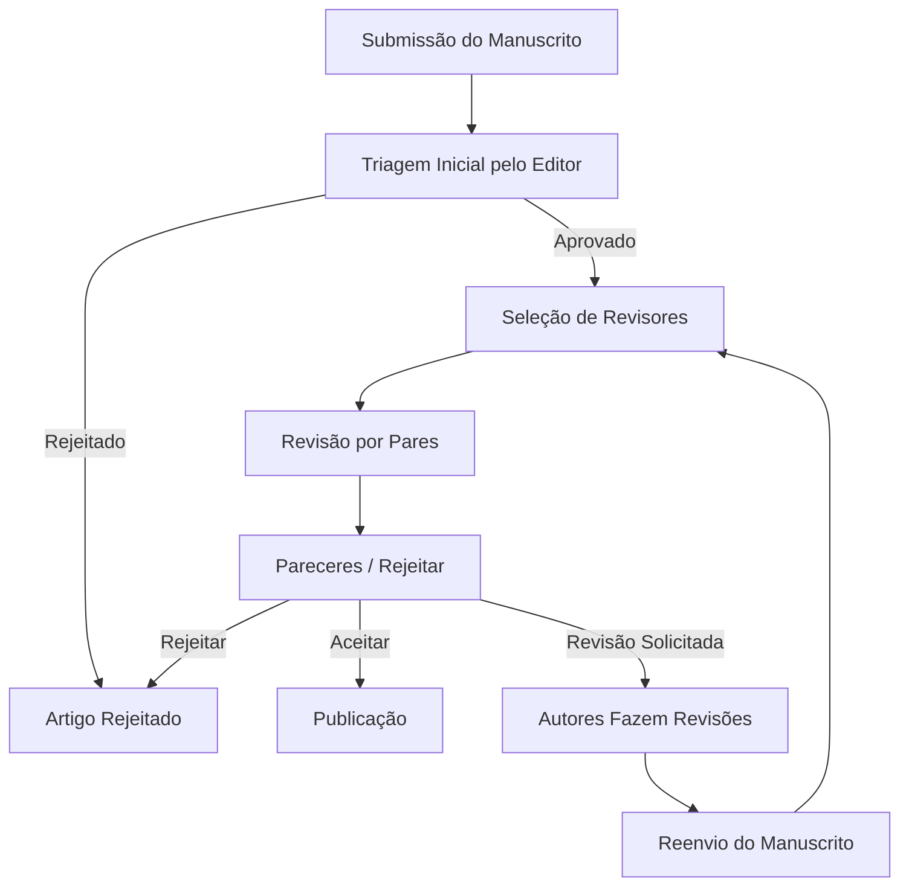

# Avaliação por pares

_09/12/2024_

_Por Giseldo Neo_

O processo de *avaliação por pares* (em inglês peer review) tem o objetivo de assegurar a qualidade, a precisão e a relevância dos trabalhos de pesquisa antes de serem divulgados à comunidade acadêmica.

De forma geral, o processo ocorre em várias etapas:

> Figura 1 - Processo de avaliação por pares

> Fonte: o Autor

**Submissão do manuscrito:**  
   Após concluir sua pesquisa, os autores organizam seus resultados em um artigo científico e o submetem a um periódico especializado. Neste ponto, o texto ainda não foi aprovado nem revisado, apenas recebido pela equipe editorial.

**Triagem inicial pelo editor:**  
   O editor-chefe ou um editor de área do periódico realiza uma avaliação preliminar do manuscrito. Eles verificam se o trabalho está dentro do escopo da revista, se segue as normas de formatação e se possui relevância e originalidade suficientes para passar para a próxima etapa. Caso o artigo não atenda a esses critérios mínimos, pode ser rejeitado sumariamente (desk reject).

**Seleção dos revisores:**  
   Caso o artigo seja considerado adequado na triagem inicial, o editor seleciona revisores com conhecimento especializado no tópico abordado. Geralmente são de dois a quatro revisores, pesquisadores experientes e muitas vezes anônimos (o que se denomina “avaliação por pares cega”, onde os revisores não conhecem a identidade dos autores, e vice-versa, garantindo maior imparcialidade).

**Análise do manuscrito pelos revisores:**  
   Cada revisor recebe o artigo e o avalia quanto a sua qualidade científica, clareza do texto, robustez metodológica, adequação das análises estatísticas, relevância dos resultados, originalidade, fundamentação teórica e correção das conclusões. Os revisores podem sugerir melhorias, apontar falhas ou inconsistências, e avaliar se o trabalho contribui efetivamente para o campo de conhecimento em questão.

**Emissão dos pareceres:**  
   Após analisarem o texto, os revisores encaminham ao editor um parecer detalhado, com comentários, críticas construtivas, sugestões de melhorias e um parecer final recomendando uma das opções, em geral:  
   - **Aceitar sem alterações** (raramente ocorre na primeira rodada),  
   - **Solicitar revisões** (menores ou maiores),  
   - **Rejeitar o manuscrito**.

**Decisão editorial:**  
   Com base nos pareceres dos revisores, o editor decide o destino do manuscrito. Normalmente, se houver sugestões de melhorias, o artigo não é simplesmente rejeitado de imediato; ao contrário, os autores têm a oportunidade de revisar seu trabalho e responder aos pontos levantados.

**Revisão pelo autor e reenvio:**  
   Os autores revisam o manuscrito conforme as recomendações dos revisores e fornecem respostas detalhadas a cada comentário. Em seguida, reenviam o texto para o editor.

**Nova rodada de avaliação (caso necessário):**  
   As revisões podem passar por novas rodadas de avaliação, se os revisores ou o editor julgarem necessário. Esse processo continua até que o artigo atenda aos padrões de qualidade exigidos pela revista ou seja definitivamente rejeitado.

**Publicação:**  
   Uma vez que o artigo é aceito, ele segue para a etapa de editoração final, incluindo diagramação, revisões de linguagem e formatação, para então ser publicado na revista, tornando-se acessível à comunidade científica.

## Resumo

Em resumo, o processo de revisão por pares é um diálogo construtivo entre autores e revisores, mediado pelos editores, com o propósito de aprimorar a qualidade científica do trabalho antes da publicação, garantindo assim a credibilidade e a integridade da literatura acadêmica.

. . .

_
Até o próximo artigo
_

<Layout />
