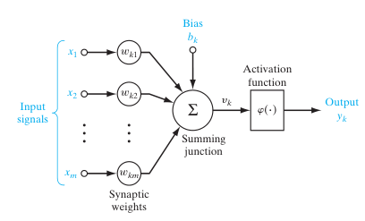

# {{ $frontmatter.title }}

{{ $frontmatter.description }}

  
  

    
Giseldo Neo

    
12/12/2024

    
Partes deste texto foram criadas e revisadas com IA generativa.

  

## Introdução

Este texto é uma continuação do post anterior [redes neurais #1](/posts/2024-04-01-redes-neurais-1).

As redes neurais aprendem ajustando pesos e vieses com base nos dados fornecidos e nos resultados obtidos. Esses pesos e vieses determinam como os dados de entrada influenciam o resultado final do modelo. Em problemas de classificação, por exemplo, a rede pode gerar como saída um vetor de probabilidades para cada classe. A calibração desses pesos e vieses ocorre por meio de um processo chamado de **gradiente do erro**, que se baseia no desempenho da rede medido por uma função de perda.

Na Figura 1 é apresentado um neurônio artificial K e seus elementos: a função de ativação (_activation function_), os pesos _Wk1 até Wkn_, e o bias (_Bias_) (b), além das entradas e as saídas.

> Figura 1 - Um neurônio artificial
> 
> Fonte: Neural Networks and Learning Machines. Simon Hayking (2024)

## Função de perda

A **função de perda** é uma métrica que avalia o quão bem a rede está performando. Para problemas de regressão, uma função comum é o **erro quadrático médio**, que mede a diferença entre os valores previstos e os reais. Já para problemas de classificação, utiliza-se frequentemente a **perda por entropia cruzada**, que considera as probabilidades das classes previstas. Com base na perda calculada, inicia-se o processo de **retropropagação**.

## Retropropagação

A **retropropagação** consiste em atualizar os pesos e vieses da rede a partir dos gradientes da função de perda com relação a essas variáveis. Esse processo utiliza a **regra da cadeia**, pois o cálculo dos gradientes envolve derivadas parciais acumuladas ao longo das camadas da rede. Inicialmente, os pesos e vieses são configurados aleatoriamente e, durante a retropropagação, ajustam-se para minimizar a perda. O objetivo é determinar se os valores atuais devem ser aumentados ou reduzidos e em que proporção.

## Descida do gradiente

O mecanismo que conduz esses ajustes é conhecido como **descida do gradiente**, que busca o ponto mínimo da função de perda. Intuitivamente, o gradiente indica a inclinação da função em relação aos pesos e vieses, permitindo que a rede se mova na direção que reduz o erro. Se o gradiente for positivo, ajusta-se para um valor menor; se negativo, ajusta-se para um valor maior. O processo de ajuste é influenciado pela **taxa de aprendizado**, que controla a magnitude dos passos dados na direção do mínimo.

Durante o aprendizado, cada neurônio recebe um dado de entrada, o multiplica pelos pesos, soma o viés e aplica uma função de ativação, produzindo uma saída. Esse processo se repete para todas as camadas até gerar a saída final, que será avaliada pela função de perda. Com os ajustes feitos na retropropagação, os dados são novamente passados pela rede, repetindo o ciclo até atingir a perda desejada ou o número máximo de iterações.

Esse processo iterativo, essencial para redes neurais, permite que elas aprendam padrões complexos nos dados e ajustem seus parâmetros para alcançar um desempenho otimizado. A combinação de conceitos como função de perda, retropropagação, descida do gradiente e taxa de aprendizado forma a base do aprendizado em redes neurais.

## Referências

[ai but simple Issue 2](https://www.aibutsimple.com/p/neural-networks-learning-parameters-weights-biases-backprop)

. . .

_
Até a próxima postagem
_