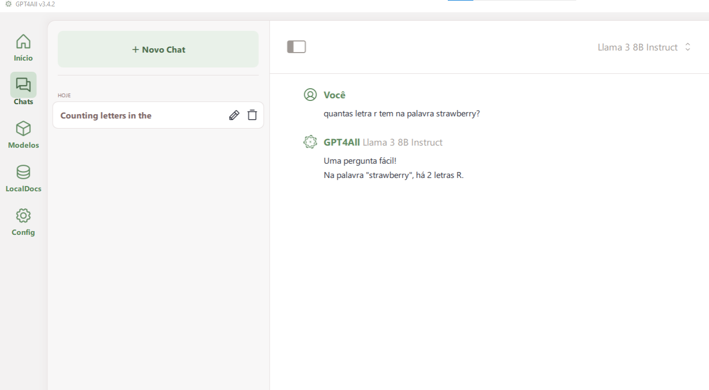

Existem softwares específicos para utilizar modelos de LLM Locais, ou mesmo acessar vários modelos de LLM on-line. Uma grande vantagem destes softwares é utilizar a mesma interface para diferente modelos.

Alguns exemplos notáveis são:

* [GPT4ALL](https://www.nomic.ai/gpt4all)
  
* JEN

* LLMStudio

* Msty.

## GPT4ALL

o [GPT4ALL](https://www.nomic.ai/gpt4all) é uma plataforma que permite a execução de Modelos LLMs em hardware de relativo baixo custo, incluindo CPUs e GPUs. Esta plataforma é compatível com Mac M Series chips, AMD e NVIDIA GPUs. Portanto é possível utilizar o GPT4All em desktops e laptops comuns. Veja na **Figura 1** um Print Screen do GPT4ALL do meu PC.

> **Figura 1** - Print Screen do GPT4ALL de um PC
> 
> Fonte: Giseldo Neo

Ele foi desenvolvido pela empresa Nomic AI e está disponível gratuitamente para download no [github](https://github.com/nomic-ai/gpt4all/tree/main). Em resumo é um ecossistema para treinamento e implantação de modelos de linguagem personalizados e poderosos para executar localmente.

## LLMStudio

Em breve ...

Curtiu? Deixei um comentário. Até o próximo post.
