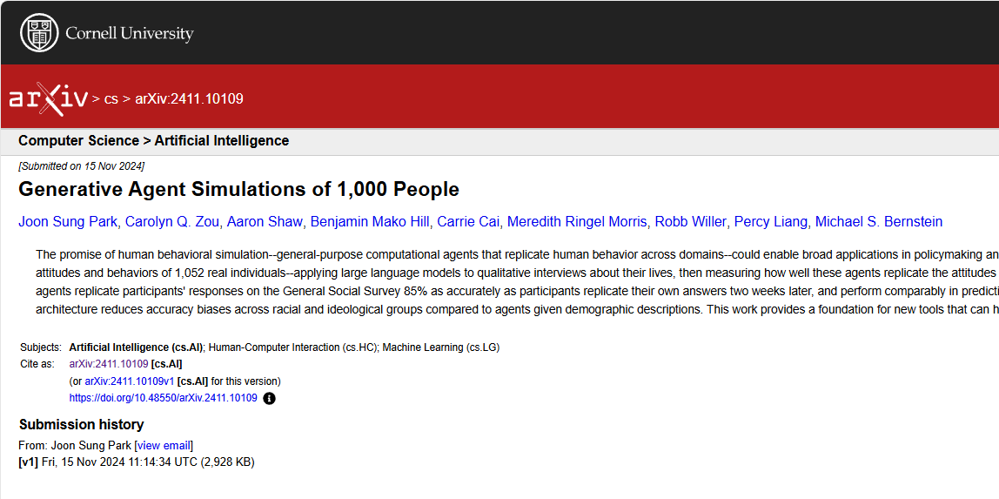

## Introdução

[Paula Bernardes](https://www.youtube.com/watch?v=N3WOqh8gg1c), no seu canal do youtube, comentou um artigo publicado no [arxiv](https://arxiv.org/) (um repositório de artigos aberto) com o título ["Generative Agent Simulations of 1,000 People"](https://arxiv.org/abs/2411.10109) (**Figura 1**). Este artigo explora o desenvolvimento e a aplicação de uma nova arquitetura de agentes generativos que simulam atitudes e comportamentos de indivíduos reais. Foi criado uma plataforma para testar intervenções, desenvolver teorias e aprofundar a compreensão do comportamento individual e coletivo (**Figura 2**).

> **Figura 1** - Foto do Arxiv
> 
> Fonte: o Autor

## Metodologia

Os pesquisadores coletaram dados de mais de 1.000 participantes por meio de entrevistas qualitativas de duas horas e uma série de pesquisas e experimentos. As transcrições das entrevistas, juntamente com reflexões especializadas que extraem insights do texto, formam a base de conhecimento para os agentes generativos. Um modelo de linguagem de grande escala, o GPT-4o, foi usado para gerar as reflexões e simular as respostas dos agentes.

> **Figura 2** - Arquitetura abstrata da metodologia do artigo
> 
> Fonte: [imagem retirada do artigo](https://arxiv.org/abs/2411.10109)

## Conclusão

Os agentes generativos demonstraram uma capacidade de replicar as atitudes e comportamentos dos participantes. Eles replicaram as respostas dos participantes com 85% da precisão. Além disso, eles tiveram um desempenho comparável na previsão de traços de personalidade e resultados em replicações experimentais. O uso de entrevistas para informar o comportamento dos agentes reduziu vieses de precisão em grupos raciais e ideológicos em comparação com agentes que receberam apenas descrições demográficas.

Em resumo, o artigo apresenta uma arquitetura para simular o comportamento humano.

Até o próximo post.
